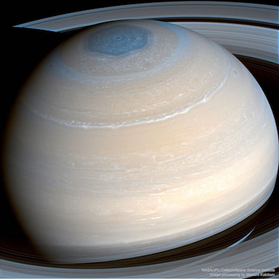

# cf-saturn

[](http://travis-ci.org/mgenware/cf-saturn)



A Wiki-like static content generator we use at Coldfunction Knowledge Library: [https://coldfunction.com/k](https://coldfunction.com/k) (Chinese Simplified).

## Installation
```sh
go get github.com/mgenware/cf-saturn
```
